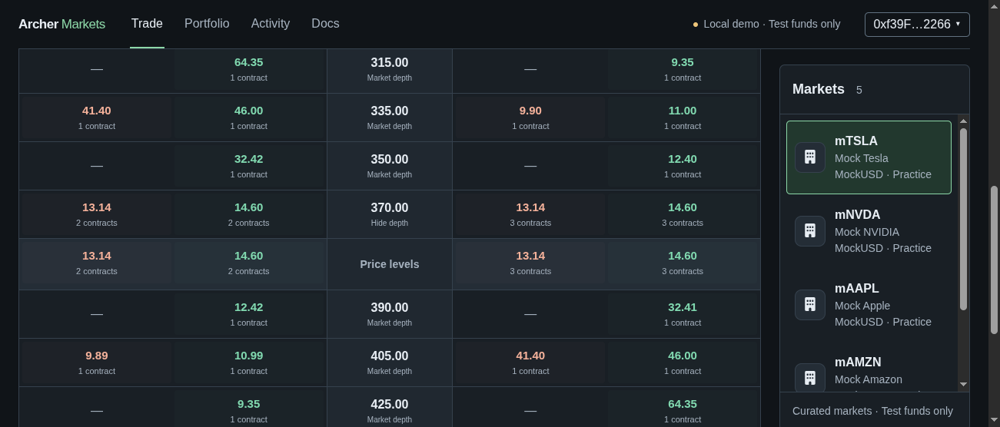
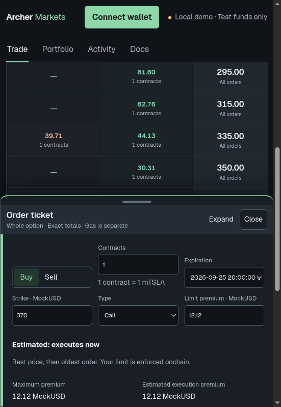

# Try Archer Markets locally

Use **anvil0** and **anvil1** in separate wallet/browser profiles. Both receive stock
and MockUSD, with no seeded positions. Accounts 2–9 populate five synthetic markets.

## Start

Requirements: Node.js 22.13+ and Docker accessible to your user
([Linux setup](https://docs.docker.com/engine/install/linux-postinstall/)).
Foundry runs in Docker; no native installation is needed.

```sh
npm ci
npm --prefix web ci
npm run contracts:deps
npm run anvil
```

Keep that terminal open: Anvil runs in the foreground. In another terminal:

```sh
npm run demo:local
npm run dev:local
```

Open the printed frontend URL, normally http://localhost:3000. Configure both wallets
with RPC **http://127.0.0.1:8545**, chain **31337**, currency **ETH**, using Anvil accounts
0 and 1 from its terminal. Connect and select **Mock Tesla**.



Each player receives **100 of each stock** and **10,000 MockUSD** once. Rerunning the
seed preserves trades and spent balances. Wallet menu faucets provide more mocks.



The screenshot shows a seeded quote; the walkthrough below uses strike 300 and premium 10.

## Maker: sell one call

As **anvil0**, choose **Trade → Sell**, Call, strike **300**, limit premium **10**.
Quantity is fixed at **1**. Choose a custom expiration tomorrow with a distinct time
so this walkthrough uses its own series.

Review, acknowledge manual exercise, then **Confirm sell** and approve if asked.
One mTSLA leaves your available balance and becomes collateral. The ask rests at 10
until matched. Find it in Trade and Portfolio.

## Taker: buy, then exercise

As **anvil1**, select the same expiration and click that ask at strike 300. The same
ticket opens. Set your buy limit to **12**: the estimate should show execution at **10**.
Review and confirm. The transaction pays 10 to the writer and gives you the option.

In **Portfolio**, expand it with **Review exercise**, then **Exercise option**. Approve
300 MockUSD if prompted and exercise before expiration.

| Wallet | Final stock change | Final MockUSD change |
| --- | --- | --- |
| anvil0 / writer | −1 mTSLA | +310 |
| anvil1 / holder | +1 mTSLA | −310 |

ETH gas is separate. The option appears under **Closed & resold options → Exercised**.
Buying alone does not deliver stock.

## Try the other paths

- **Bid first:** as anvil1, Buy a Put at strike 300, premium 10 and a new expiration.
  It reserves 10 MockUSD. As anvil0, click its bid to Sell: depositing 300 creates the
  option and pays the resting premium of 10. The buyer exercises by delivering 1 mTSLA.
- **Cancel:** cancel an unmatched bid or unsold ask from Portfolio. Its reserved
  premium or collateral returns. Sold options cannot be canceled by their writer.
- **Resell:** buy an option, then choose **Sell owned option** in Portfolio. Set a
  premium in the same ticket. It competes with new asks; no new collateral is deposited.
- **Depth:** post two asks at the same price and series. Trade should show **2 contracts**.
  One buy removes only the oldest. Bid is the highest buy price; ask is the lowest sell price.

## Where to look

**Portfolio:** available balances, locked collateral, bids, holdings and contract details.
**Activity:** submissions and receipt status from this browser. After expiration,
recover unused collateral or bid premiums manually; neither is withdrawn automatically.

Ctrl+C stops Anvil and discards that container's chain. After a fresh start, rerun the
seed; clear stale wallet activity if needed. Use `npm run dev:local` for chain 31337.
Automated acceptance owns separate Docker nodes and does not reset this demo:

```sh
npm run test:acceptance:v4
```

[How it works](how-it-works.md) · [Implementation evidence](research/implementation.md)
