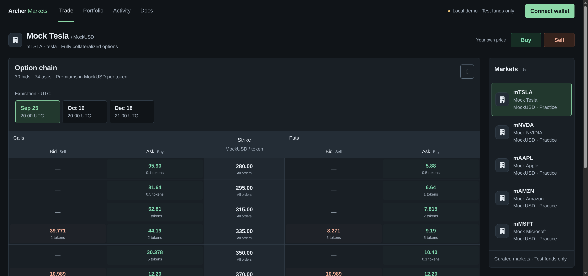

# Try Archer Markets locally

Use **anvil0** and **anvil1** in separate wallet/browser profiles. Both start with tokens
and no option positions. Accounts **anvil2–anvil9** populate the market. All assets are
local mocks with no real value.

## 1. Start the app

Requirements: Node.js 22.13+ and a running Docker engine accessible to your user
([Linux permissions setup](https://docs.docker.com/engine/install/linux-postinstall/)).
Foundry runs in Docker; no native `forge`, `anvil` or `cast` installation is needed.
From the repository root:

```sh
docker version
npm ci
npm --prefix web ci
npm run contracts:deps
```

Terminal A — keep the local chain running:

```sh
npm run anvil
```

Anvil runs in the foreground with its standard output. Keep this terminal open.

Terminal B — populate the five markets and start the frontend:

```sh
npm run demo:local
npm run dev:local
```

Open the printed URL, normally <http://localhost:3000>, in both profiles.
Select **Mock Tesla** in both. You should see **390 seeded options** across five markets
(370 initially listed, including resales) and **150 open buy requests**. Prices are synthetic.



## 2. Prepare both wallets

Add the network to each wallet: **Local Anvil**, RPC **http://127.0.0.1:8545**,
chain ID **31337**, currency **ETH**, no explorer. Connect each wallet to the app.

Use Anvil accounts **(0)** and **(1)** printed in its terminal. Each already has local ETH.
After seeding, **Portfolio → Available** should show, for each account:

- **100 each:** mTSLA, mNVDA, mAAPL, mAMZN and mMSFT.
- **10,000 MockUSD** and no seeded options or requests.

The seed funds these wallets once; rerunning it preserves your trades and does not refill
spent balances. For more tokens later, use **Wallet menu → Get [token]** in the selected market.

To start immediately, click an Ask to buy, or a Bid to sell a new option to an NPC.
The following walkthrough makes a new agreement between your two wallets.

## 3. Maker: sell a new call

As **anvil0**, go to **Trade → Sell** to post an ask. Choose **Call**, enter **0.2** tokens,
**60** total exercise payment, **2** total option price, and **Custom expiration…** set to tomorrow.
Review, approve the collateral if prompted, then choose **Post ask & deposit collateral**.

The writer's available stock decreases by **0.2**. That amount is now locked in the
option; no premium has arrived yet. Find the offer in **Portfolio** and **Trade**.

## 4. Taker: buy and exercise

As **anvil1**, open **Trade**, select the expiration and expand
the **300** strike row (60 ÷ 0.2). Click the Ask for anvil0's 0.2-token offer, review it and acknowledge
manual exercise. Approve the **2 MockUSD** premium if needed, then confirm purchase.

The buyer now holds the option. The writer receives **2 MockUSD** and cannot cancel it.
In the buyer's **Portfolio**, expand the position and choose **Review exercise**.
Approve **60 MockUSD** if needed, then exercise before expiration.

| Wallet | Final stock change | Final MockUSD change |
| --- | --- | --- |
| Maker / writer | −0.2 | +62 |
| Taker / buyer | +0.2 | −62 |

Compare against the initial seeded balances. Gas affects ETH separately. The option
should show **Exercised** under **Portfolio → Closed & resold options**, with no
remaining collateral. Buying alone does not deliver stock.

## 5. Reverse the roles: post a bid for a put

The buyer is now the **maker**. In **Trade → Buy**, choose
**Put**, quantity **0.2**, exercise payment **60**, premium **2**, expiration tomorrow,
and **Accept until** earlier than expiration. Choose **Post bid & reserve premium**.
Portfolio now shows **2 MockUSD in request premiums**; there is no option yet.

The writer is now the **taker**. Click the Bid in the option chain, review and **Sell & deposit collateral**.
The writer must have **60 MockUSD upfront**: the 2 premium cannot fund the deposit.
Acceptance locks 60, pays the writer 2 and gives the buyer one option.

The buyer exercises from Portfolio, delivering **0.2 mTSLA** to receive **60 MockUSD**.
Net for this put alone: buyer −0.2 stock / +58 MockUSD; writer +0.2 stock / −58 MockUSD.

## Where to check / retry

- **Portfolio:** available balances, locked collateral, reserved premiums and positions.
  Expand a position for **Contract details & exercise funding**, including its address.
- **Activity:** submitted transactions and confirmation status in this browser.
- **Cancellation:** publish a second offer or request, leave it unaccepted, then cancel.
  Its collateral or reserved premium should return in full.
- **After expiration:** exercise is unavailable. Writers reclaim unused collateral;
  requesters recover unaccepted premiums. Neither recovery happens automatically.

Ctrl+C stops Anvil and removes its container and state. After restarting it, rerun
`npm run demo:local`. If your wallet reports a stale nonce, clear its local activity for this network.
If the app shows Robinhood Chain Testnet, restart with `npm run dev:local`.
If the first page load fails while Vite prepares dependencies, stop and restart
`npm run dev:local`, then reload. Never run time-advancing E2E tests against this node.

[How it works](how-it-works.md) · [Automated checks and evidence](research/security-review.md)
